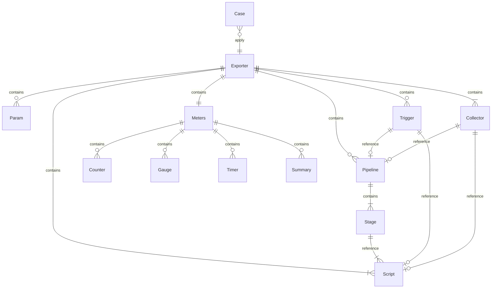
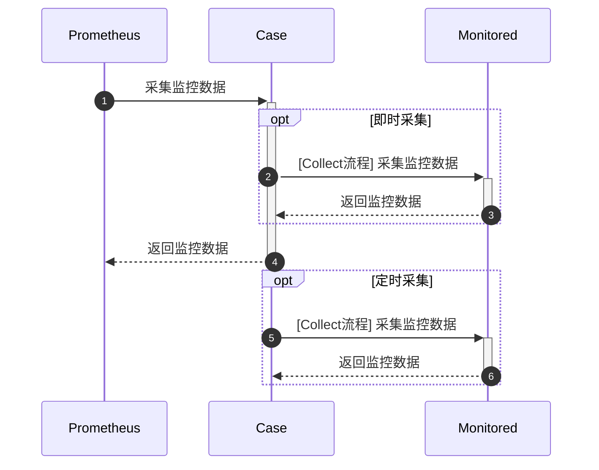

# 项目简述
BlackBox是一个指标采集器框架，通过配置与脚本即可定义采集器。

* 采集器(**Exporter**) 
  * 由exporter.yml定义
  * 是一套采集方案
  * 由脚本定义采集逻辑

* 采集用例(**Case**) 
  * 由case.yml定义
  * 是Exporter的具体执行

**实体关系**


**主要流程**

```mermaid
flowchart TD;
subgraph 采集流程
    CollectStart(Collect 采集 开始) --> BeforeTrigger_1(Trigger 前置触发器 1)
    BeforeTrigger_1 -- 触发器之间串行 --> BeforeTrigger_n(Trigger 前置触发器 n)

    BeforeTrigger_n -- 模块之间并行 --> Collector_1(Collector 采集模块 1)
    BeforeTrigger_n -- 模块之间并行 --> Collector_n(Collector 采集模块 n)
   
    Collector_1 & Collector_n --> AfterTrigger_1(Trigger 后置触发器 1)

    AfterTrigger_1 -- 触发器之间串行 --> AfterTrigger_n(Trigger 后置触发器 n)
    AfterTrigger_n --> CollectEnd(Collect 采集 结束)
end

subgraph 流水线流程
    PipelineStart(Pipeline 流水线 开始) --> PipelineStageSerialStart(Stage 场景 1 Serial 串行模式 开始)
    PipelineStageSerialStart --> PipelineStageSerialScript_1(Script 脚本 1)
    PipelineStageSerialScript_1 -- 串行执行脚本 --> PipelineStageSerialScript_n(Script 脚本 n)
    PipelineStageSerialScript_n --> PipelineStageSerialEnd(Stage 场景 1 Serial 串行模式 结束)
    
    PipelineStageSerialEnd -- 场景之间串行 --> PipelineStageParallelStart(Stage 场景 n Parallel 并行模式 开始)
    PipelineStageParallelStart -- 并行执行脚本 --> PipelineStageParallelScript_1(Script 脚本 1)
    PipelineStageParallelStart -- 并行执行脚本 --> PipelineStageParallelScript_n(Script 脚本 n)
    PipelineStageParallelScript_1 & PipelineStageParallelScript_n --> PipelineStageParallelEnd(Stage 场景 n Parallel 并行模式 结束)
    
    PipelineStageParallelEnd --> PipelineEnd(Pipeline 流水线 结束)
end
```


**采集时序**


# 应用配置
```yaml
server.port: 8030 # 服务端口
blackbox.rootPath: /config # 存放配置的根目录
```

# 配置说明
**目录结构**

{id} 表示id为可变量
```text
{rootPath} 配置根目录
    /exporters # 采集器目录
        /{exporter_name_1} # 某采集器目录 名称与exporter.yml的name一致
            exporter.yml # 采集器配置
            /scripts # 脚本目录
                {script_name_1}.js # 脚本文件
                ...
                {script_name_n}.js
        ...
        /{exporter_name_n}
            exporter.yml
            /scripts
                {script_name_1}.js
                ...
                {script_name_n}.js
    /cases # 用例目录
        /{case_name_1} # 某用例目录 名称与case.yml的name一致
            case.yml # 用例配置
            /logs # 日志目录
        ...
        /{case_name_n}
            case.yml
            /logs
    /logs # 应用日志目录
```
**yml结构**
* exporter.yml 结构为**Exporter**
* case.yml 结构为**Case**

**附加说明**
* **TypeName[RealTypeName]** 表示类型**TypeName**的实际类型为**RealTypeName**
* 命名规则**NAME** 
  * 可以包含数字[0-9]、字母[a-zA-Z]、下划线[_]、中划线[-]
  * 字母开头
  * 大小写敏感
* 命名规则**KEY**
  * 可以包含数字[0-9]、字母[a-zA-Z]、下划线[_]
  * 字母开头
  * 大小写敏感
* 命名规则**METRIC**
  * 可以包含数字[0-9]、字母[a-zA-Z]、下划线[_]、点[.]
  * 字母开头
  * 大小写敏感

**Exporter** 采集器

| 属性名        | 类型                | 必填  | 约束                | 描述                                   |
|------------|-------------------|-----|-------------------|--------------------------------------|
| name       | String            | `*` | 命名规则**NAME** 全局唯一 | 采集器名称                                |
| monitors   | **MonitorEnum[]** | `*` |                   | 支持的监控系统                              | 
| params     | **Param**         |     |                   | 参数 一般用于定义环境相关的参数 每个Case可以传入不同的params | 
| meters     | **Meters**        | `*` |                   | 指标定义                                 |
| scripts    | **Script[]**      | `*` |                   | 脚本 映射脚本文件 一个名称name对应一个脚本文件 用于后续使用    |
| pipelines  | **Pipeline[]**    |     |                   | 流水线 编排Script的执行流程                    |
| triggers   | **Trigger[]**     |     |                   | 触发器 根据Event与Time触发Pipeline           |
| collectors | **Collector[]**   | `*` |                   | 采集模块 每个模块流程对应一个Pipeline 可以定义多个采集模块   |

**Case** 用例

| 属性名        | 类型              | 必填  | 约束                     | 描述                                                                                                           |
|------------|-----------------|-----|------------------------|--------------------------------------------------------------------------------------------------------------|
| name       | String          | `*` | 命名规则**NAME** 全局唯一      | 用例名称                                                                                                         |
| exporter   | String          | `*` | 值参照Exporter.name       | 对应的采集器名称                                                                                                     |
| monitor    | **MonitorEnum** | `*` | 值参照Exporter.monitors   | 指标上报的监控系统                                                                                                    |
| params     | **JSON**        |     | 结构参照Exporter.params    | 实际参数 脚本里通过$.params获取                                                                                         |
| commonTags | **JSON**        |     | 键值类型都为String           | 全局tag 在每个指标上都会加上commonTags定义的tag 例如commonTags={"t1": "v1"} Prometheus指标xxx_total则会加上label xxx_total{t1="v1"} |
| collectors | String[]        | `*` | 值参照Exporter.collectors | 需要采集的模块                                                                                                      |
| logging    | **Logging**     |     |                        | 日志配置 日志实现采用Logback                                                                                           |

**JSON** 键值对 

在脚本中通过object.propName或者object["propName"]获取属性值

**MonitorEnum[String]** 监控系统枚举

| 值          | 描述             |
|------------|----------------|
| PROMETHEUS | Prometheus监控系统 |

**Logging** 日志配置 

日志文件按照日期划分

| 属性名          | 类型               | 必填  | 约束      | 描述                    |
|--------------|------------------|-----|---------|-----------------------|
| level        | **LogLevelEnum** |     | 默认WARN  | 日志级别                  |
| maxFileSize  | String           |     | 默认100MB | 单个日志文件大小限制 单位KB MB GB |
| totalSizeCap | String           |     | 默认1GB   | 日志总大小上限 单位KB MB GB    |
| maxHistory   | Integer          |     | 默认30    | 日志保留天数                |

**LogLevelEnum[String]** 日志级别枚举

| 值     | 描述       |
|-------|----------|
| ALL   | 所有日志都打印  |
| TRACE |          |
| DEBUG |          |
| INFO  |          |
| WARN  |          |
| ERROR |          |
| OFF   | 所有日志都不打印 |

**Param** 参数

| 属性名      | 类型                | 必填  | 约束                 | 描述                 |
|----------|-------------------|-----|--------------------|--------------------|
| name     | String            | `*` | 命名规则**KEY** 同层级下唯一 | 参数名                |
| value    | Object            |     |                    | 参数默认值              |
| type     | **ValueTypeEnum** | `*` | 默认STRING           | 参数值类型              |
| required | Boolean           | `*` | 默认true             | 参数值类型              |
| nest     | **Param[]**       |     |                    | 嵌套结构 当type为NEST时定义 |

**ValueTypeEnum[String]** 值类型

| 值      | 描述  |
|--------|-----|
| STRING | 字符型 |
| NUMBER | 数字型 |
| NEST   | 嵌套型 |

**Meters** 指标定义

至少定义一种类型的指标

| 属性名       | 类型            | 必填  | 约束  | 描述          |
|-----------|---------------|-----|-----|-------------|
| counters  | **Counter[]** |     |     | Counter类型指标 |
| gauges    | **Gauge[]**   |     |     | Gauge类型指标   |
| timers    | **Timer[]**   |     |     | Timer类型指标   |
| summaries | **Summary[]** |     |     | Summary类型指标 |

**Counter**

| 属性名  | 类型       | 必填  | 约束                       | 描述                                                                       |
|------|----------|-----|--------------------------|--------------------------------------------------------------------------|
| name | String   | `*` | 命名规则**METRIC** Meters下唯一 | 指标名 命名风格推荐xxx.xxx.xxx方式 根据不同的监控系统会生成对应风格的指标名 例如Prometheus则最终为xxx_xxx_xxx |
| desc | String   | `*` |                          | 描述                                                                       |
| unit | String   |     | 命名规则**KEY**              | 单位 会以一定风格拼接到指标名                                                          |
| tags | String[] |     | 命名规则**KEY**              | 指标的tag集合 例如Prometheus则为label集合                                           |

**Gauge**

| 属性名  | 类型       | 必填  | 约束                       | 描述       |
|------|----------|-----|--------------------------|----------|
| name | String   | `*` | 命名规则**METRIC** Meters下唯一 | 同Counter |
| desc | String   | `*` |                          | 同Counter |
| unit | String   |     | 同Counter                 | 同Counter |
| tags | String[] |     | 同Counter                 | 同Counter |

**Timer** 

Timer专用于时间

| 属性名                    | 类型               | 必填  | 约束                       | 描述                                                                                                                                                                                                                                                                                                                                                                                  |
|------------------------|------------------|-----|--------------------------|-------------------------------------------------------------------------------------------------------------------------------------------------------------------------------------------------------------------------------------------------------------------------------------------------------------------------------------------------------------------------------------|
| name                   | String           | `*` | 命名规则**METRIC** Meters下唯一 | 同Counter                                                                                                                                                                                                                                                                                                                                                                            |
| desc                   | String           | `*` |                          | 同Counter                                                                                                                                                                                                                                                                                                                                                                            |
| unit                   | String           |     |                          | 不支持                                                                                                                                                                                                                                                                                                                                                                                 |
| tags                   | String[]         |     | 同Counter                 | 同Counter                                                                                                                                                                                                                                                                                                                                                                            |
| percentileHistogram    | Boolean          |     |                          | 用于在Prometheus（使用histogram_quantile）、Atlas（使用：percentrice）和Wavefront（使用hs（））中发布适用于计算可聚合（跨维度）百分比近似值的直方图。对于Prometheus和Atlas，Micrometer基于Netflix根据经验确定的生成器预设了生成直方图中的桶，以产生大多数真实世界计时器和分发摘要的合理误差。默认情况下，生成器生成276个桶，但Micrometer仅包含在minimumExpectedValue和maximumExpectedValue（含）设置的范围内的桶。默认情况下，千分尺将计时器钳制在1毫秒到1分钟的范围内，每个计时器维度产生73个直方图桶。publishPercentileHistogram对不支持聚合百分比近似的系统没有影响。这些系统没有直方图。 | 
| percentiles            | Double[]         |     | 值域[0,1]                  | 客户端计算分位线 用于发布应用程序中计算的百分比值 这些值在维度之间不可聚合                                                                                                                                                                                                                                                                                                                                              |
| serviceLevelObjectives | Double[]         |     |                          | 服务端计算分位线 用于发布具有SLO定义的桶的累积直方图。当在支持可聚合百分位数的监控系统上与publishPercentileHistogram一起使用时，此设置会向已发布的直方图添加额外的桶。当在不支持可聚合百分位数的系统上使用时，此设置会导致仅使用这些桶发布直方图。若Prometheus则为bucket的le标签值 值单位由timeUnit配置                                                                                                                                                                                                    |
| minimumExpectedValue   | Double           |     |                          | 接受的最小值 值单位由timeUnit配置                                                                                                                                                                                                                                                                                                                                                               |
| maximumExpectedValue   | Double           |     |                          | 接受的最大值 值单位由timeUnit配置                                                                                                                                                                                                                                                                                                                                                               |
| percentilePrecision    | Integer          |     | 默认1                      | 精度                                                                                                                                                                                                                                                                                                                                                                                  |
| expiry                 | Double           |     | 默认2分钟                    | 用于计算窗口统计数据的步长 如max 值单位由timeUnit配置                                                                                                                                                                                                                                                                                                                                                   | 
| bufferLength           | Integer          |     | 默认3                      | 缓冲长度                                                                                                                                                                                                                                                                                                                                                                                |
| timeUnit               | **TimeUnitEnum** | `*` | 默认SECOND                 | 时间单位                                                                                                                                                                                                                                                                                                                                                                                |

**TimeUnitEnum[String]** 时间单位

| 值            | 描述  |
|--------------|-----|
| MILLISECONDS | 毫秒  |
| SECONDS      | 秒   |
| MINUTES      | 分   |

**Summary**

| 属性名                    | 类型               | 必填  | 约束                       | 描述                                                                                                                                                                                                                                                                                                                                                                                  |
|------------------------|------------------|-----|--------------------------|-------------------------------------------------------------------------------------------------------------------------------------------------------------------------------------------------------------------------------------------------------------------------------------------------------------------------------------------------------------------------------------|
| name                   | String           | `*` | 命名规则**METRIC** Meters下唯一 | 同Counter                                                                                                                                                                                                                                                                                                                                                                            |
| desc                   | String           | `*` |                          | 同Counter                                                                                                                                                                                                                                                                                                                                                                            |
| unit                   | String           |     | 同Counter                 | 同Counter                                                                                                                                                                                                                                                                                                                                                                            |
| tags                   | String[]         |     | 同Counter                 | 同Counter                                                                                                                                                                                                                                                                                                                                                                            |
| percentileHistogram    | Boolean          |     |                          | 用于在Prometheus（使用histogram_quantile）、Atlas（使用：percentrice）和Wavefront（使用hs（））中发布适用于计算可聚合（跨维度）百分比近似值的直方图。对于Prometheus和Atlas，Micrometer基于Netflix根据经验确定的生成器预设了生成直方图中的桶，以产生大多数真实世界计时器和分发摘要的合理误差。默认情况下，生成器生成276个桶，但Micrometer仅包含在minimumExpectedValue和maximumExpectedValue（含）设置的范围内的桶。默认情况下，千分尺将计时器钳制在1毫秒到1分钟的范围内，每个计时器维度产生73个直方图桶。publishPercentileHistogram对不支持聚合百分比近似的系统没有影响。这些系统没有直方图。 | 
| percentiles            | Double[]         |     | 值域[0,1]                  | 客户端计算分位线 用于发布应用程序中计算的百分比值 这些值在维度之间不可聚合                                                                                                                                                                                                                                                                                                                                              |
| serviceLevelObjectives | Double[]         |     |                          | 服务端计算分位线 用于发布具有SLO定义的桶的累积直方图。当在支持可聚合百分位数的监控系统上与publishPercentileHistogram一起使用时，此设置会向已发布的直方图添加额外的桶。当在不支持可聚合百分位数的系统上使用时，此设置会导致仅使用这些桶发布直方图。若Prometheus则为bucket的le标签值 值单位由timeUnit配置                                                                                                                                                                                                    |
| minimumExpectedValue   | Double           |     |                          | 接受的最小值 值单位由timeUnit配置                                                                                                                                                                                                                                                                                                                                                               |
| maximumExpectedValue   | Double           |     |                          | 接受的最大值 值单位由timeUnit配置                                                                                                                                                                                                                                                                                                                                                               |
| percentilePrecision    | Integer          |     | 默认1                      | 精度                                                                                                                                                                                                                                                                                                                                                                                  |
| expiry                 | Double           |     | 默认2分钟                    | 用于计算窗口统计数据的步长 如max 值单位由timeUnit配置                                                                                                                                                                                                                                                                                                                                                   | 
| bufferLength           | Integer          |     | 默认3                      | 缓冲长度                                                                                                                                                                                                                                                                                                                                                                                |
| timeUnit               | **TimeUnitEnum** |     | 默认SECOND                 | 时间单位                                                                                                                                                                                                                                                                                                                                                                                |
| scale                  | Double           |     |                          | 如果采集数据值较小 可将数值放大相应倍数                                                                                                                                                                                                                                                                                                                                                                | 

**Script** 脚本

| 属性名  | 类型     | 必填  | 约束                       | 描述                                                                                                                 |
|------|--------|-----|--------------------------|--------------------------------------------------------------------------------------------------------------------|
| name | String | `*` | 命名规则**NAME** Exporter下唯一 | 名称                                                                                                                 |
| file | String | `*` |                          | 脚本文件相对路径 相对/script目录 例如{rootPath}/exporters/{exporter_name}/script/xxx/{script_name}.js为例 路径则为xxx/{script_name}.js |

**Pipeline** 流水线

| 属性名    | 类型          | 必填  | 约束                       | 描述            |
|--------|-------------|-----|--------------------------|---------------|
| name   | String      | `*` | 命名规则**NAME** Exporter下唯一 | 名称            |
| stages | **Stage[]** | `*` |                          | 场景集合 场景之间串行执行 |

**Stage** 场景 

同时配置serial和parallel 只会执行serial

| 属性名      | 类型       | 必填            | 约束             | 描述            |
|----------|----------|---------------|----------------|---------------|
| title    | String   | `*`           |                | 标题            |
| serial   | String[] | parallel为空时必填 | 值参照Script.name | 串行执行的Script集合 |
| parallel | String[] | serial为空时必填   | 值参照Script.name | 并行执行的Script集合 |

**Trigger** 触发器 

在某个事件的某个时机触发执行一个Pipeline或一个Script

| 属性名      | 类型            | 必填             | 约束               | 描述          |
|----------|---------------|----------------|------------------|-------------|
| time     | **TimeEnum**  | `*`            |                  | 时机          |
| event    | **EventEnum** | `*`            |                  | 事件          |
| pipeline | String        | 当script为空时必填   | 值参照Pipeline.name | 执行的Pipeline |
| script   | String        | 当pipeline为空时必填 | 值参照Script.name   | 执行的Script   |

**TimeEnum[String]** 时机

| 值      | 描述  |
|--------|-----|
| BEFORE | 之前  |
| AFTER  | 之后  |

**EventEnum[String]** 事件

| 值       | 描述  |
|---------|-----|
| COLLECT | 采集  |

**Collector** 采集模块 

模块之间并行执行

调用Case采集接口时并不会执行定义了cron的采集模块

| 属性名      | 类型     | 必填             | 约束                       | 描述                                         |
|----------|--------|----------------|--------------------------|--------------------------------------------|
| name     | String | `*`            | 命名规则**NAME** Exporter下唯一 | 名称                                         |
| cron     | String |                | 符合cron语法                 | 根据cron表达式定时执行 例如 `0/30 * * * * ?` 每30秒执行一次 |
| pipeline | String | 当script为空时必填   | 值参照Pipeline.name         | 执行的Pipeline                                |
| script   | String | 当pipeline为空时必填 | 值参照Script.name           | 执行的Script                                  |

# 脚本说明
脚本引擎GraalVM JavaScript

**访问权限配置**
* allowHostAccess: true

**其他可选项**
* js.ecmascript-version: 2022

**内置变量**

| 访问方式     | 类型         | 描述                                         |
|----------|------------|--------------------------------------------|
| $.params | **JSON**   | Case的参数 只读 值为Case.params                   |
| $.vars   | **Scope**  | 用来存储数据 生命周期为每次Collect                      |
| $.stores | **Scope**  | 用来存储数据 生命周期为整个Case实例                       |
| $.meters | **Meters** | 指标工具类 底层Micrometer实现                       |
| $.http   | **Http**   | Http工具类 底层JDK HttpClient实现                 |
| $.shell  | **Shell**  | Shell工具类 底层JDK Runtime.getRuntime().exec() |
| $.log    | **Log**    | 日志记录器 底层Logback实现 打印至Case的/logs目录          |
| $.json   | **Json**   | Json工具类 底层Fastjson实现                       |

**Scope** 作用域

用来存储数据 多线程安全 

底层JDK ConcurrentHashMap实现

| 方法签名                               | 约束  | 描述    |
|------------------------------------|-----|-------|
| void set(String key, Object value) |     | 设置变量值 |
| Object get(String key)             |     | 获取变量值 |
| Object remove(String key)          |     | 移除变量  |

**Meters** 指标工具类

底层Micrometer实现

| 方法签名                                 | 约束  | 描述                                    |
|--------------------------------------|-----|---------------------------------------|
| void counter(**MeterRecord** record) |     | record.value为增量                       |
| void gauge(**MeterRecord** record)   |     | record.value为当前值                      |
| void timer(**MeterRecord** record)   |     | record.value为记录时长 单位由Timer.timeUnit配置 |
| void summary(**MeterRecord** record) |     | record.value为记录值                      |

**MeterRecord[JSON]** 指标记录

| 属性名   | 类型       | 必填  | 约束                                                   | 描述              |
|-------|----------|-----|------------------------------------------------------|-----------------|
| meter | String   | `*` | 值参照Counter.name Gauge.name Timer.name Summary.name   | 指标名             |
| tags  | String[] | `*` | 值顺序参照Counter.tags Gauge.tags Timer.tags Summary.tags | tag值            |
| value | Number   | `*` |                                                      | 指标值 不同指标类型的含义不同 |

**Http** Http工具类 

底层JDK HttpClient实现

| 方法签名                                           | 约束  | 描述                               |
|------------------------------------------------|-----|----------------------------------|
| **HttpClient** getClient()                     |     | 返回http客户端  若想获取更多信息可以用Client自由实现 |
| **HttpResponse** send(**HttpRequest** request) |     | 执行http请求                         |
| String encode(String str)                      |     | url编码                            |
| String decode(String str)                      |     | url解码                            |

**HttpRequest[JSON]** Http请求

| 属性名     | 类型                 | 必填  | 约束                           | 描述       |
|---------|--------------------|-----|------------------------------|----------|
| timeout | Integer            |     |                              | 超时时长 单位秒 |
| method  | **HttpMethodEnum** |     | 默认GET                        | Http方法   |
| url     | String             | `*` |                              | 资源地址     |
| params  | **JSON**           |     | 键类型String 值类型String或String[] | url参数    |
| headers | **JSON**           |     | 键类型String 值类型String或String[] | 请求头      |
| body    | String             |     |                              | 请求体      |

**HttpMethodEnum[String]** Http方法

| 值       | 描述  |
|---------|-----|
| GET     |     |
| POST    |     |
| PUT     |     |
| PATCH   |     |
| DELETE  |     |
| OPTIONS |     |
| HEAD    |     |
| TRACE   |     |

**HttpResponse[JSON]** Http响应结果

| 属性名     | 类型      | 约束  | 描述                        |
|---------|---------|-----|---------------------------|
| code    | Integer |     | 响应状态码                     |
| headers | JSON    |     | 响应头 键类型String 值类型String[] |
| body    | String  |     | 响应数据                      |

**Shell** Shell工具类

底层JDK Runtime.getRuntime().exec()

| 方法签名                                    | 约束  | 描述    |
|-----------------------------------------|-----|-------|
| **CommandResult** exec(**Command** cmd) |     | 执行cmd |

**Command[JSON]** 命令行

| 属性名 | 类型     | 必填  | 约束  | 描述     |
|-----|--------|-----|-----|--------|
| cmd | String | `*` |     | 命令行字符串 |

**CommandResult[JSON]** 命令行执行结果

| 属性名     | 类型      | 约束  | 描述                             |
|---------|---------|-----|--------------------------------|
| code    | Integer |     | cmd执行的退出状态码 0表示命令成功结束          |
| stdout  | String  |     | 标准输出的信息                        |
| stderr  | String  |     | 标准错误输出的信息                      |
| message | String  |     | 执行cmd时异常的信息 当执行异常时 code可能为null |

**Log** 日志记录器 

底层Logback实现

对void xxx(Object format, Object... arguments)的解释
* 若format为null 则忽略arguments参数 打印null
* 若format为String类型 则format可用{}进行占位 arguments作为占位参数 例如$.log.info("name:{} age:{}", "lc", 23) 打印name:lc age:23
* 若format为Throwable类型 则忽略arguments参数 打印内容为message
* 若format为Object类型 则忽略arguments参数 打印内容为$.json.string(format)的结果

| 方法签名                                           | 约束  | 描述          |
|------------------------------------------------|-----|-------------|
| boolean isTrace()                              |     | Trace级别是否生效 |
| void trace(Object format, Object... arguments) |     | 打印Trace级别日志 |
| boolean isDebug()                              |     | Debug级别是否生效 |
| void debug(Object format, Object... arguments) |     | 打印Debug级别日志 |
| boolean isInfo()                               |     | Info级别是否生效  |
| void info(Object format, Object... arguments)  |     | 打印Info级别日志  |
| boolean isWarn()                               |     | Warn级别是否生效  |
| void warn(Object format, Object... arguments)  |     | 打印Warn级别日志  |
| boolean isError()                              |     | Error级别是否生效 |
| void error(Object format, Object... arguments) |     | 打印Error级别日志 |

**Json** Json工具类 

底层Fastjson实现

| 方法签名                        | 约束  | 描述              |
|-----------------------------|-----|-----------------|
| **JSON** parse(String json) |     | 解析json文本为JSON对象 |
| String string(Object obj)   |     | 把对象序列化成json文本   |

# OpenAPI

**根据Exporter定义 指定参数采集一次 调试Exporter Case时用**

POST /api/v1/exporters/collect

RequestHeader 
* Content-Type: application/json;charset=UTF-8

RequestBody 参数含义同Case
```json
{
  "case": {
    // case名称
    "name": null,
    // exporter名称
    "exporter": null,
    // 上报的监控系统
    "monitor": null,
    // 参数
    "params": {},
    // 公共标签
    "commonTags": {},
    // 采集模块
    "collectors": [],
    // 日志
    "logging": {}
  }
}
```

ResponseHeader
* Content-Type: text/plain;charset=UTF-8

---

**根据Case定义采集一次**

GET /api/v1/cases/{case}/collect

RequestHeader
* Content-Type: application/json;charset=UTF-8

ResponseBody
``` json
{
    "code": "0",
    "message": null,
    "result": null,
    "timestamp": "1670251593015"
}
```

---

**指标上报接口 返回Prometheus格式的指标**

GET /api/v1/cases/{case}/prometheus

ResponseHeader
* Content-Type: text/plain;charset=UTF-8 

---

**配置文件reload**

POST /api/v1/manage/reload

RequestHeader
* Content-Type: application/json;charset=UTF-8

ResponseBody
``` json
{
    "code": "0",
    "message": null,
    "result": null,
    "timestamp": "1670251593015"
}
```

---

# DEMO示例
DEMO.MD

# 参考文档
* **GraalVM JavaScript** https://www.graalvm.org/latest/reference-manual/js/JavaScriptCompatibility
* **Logback** https://logback.qos.ch/manual/configuration.html
* **Micrometer** https://micrometer.io/docs
* **Fastjson** https://github.com/alibaba/fastjson